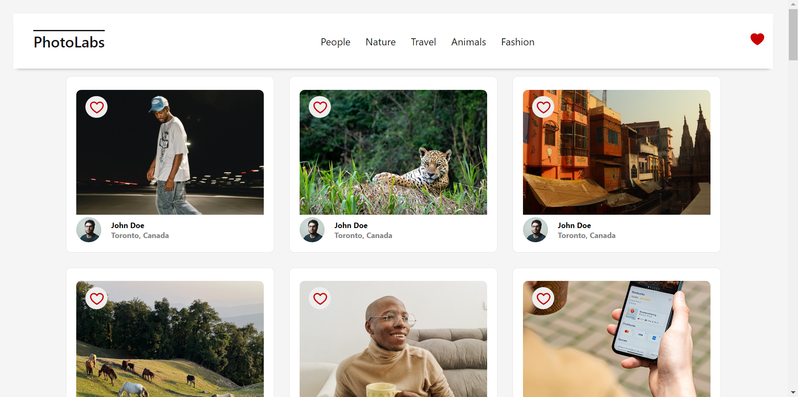

# Photolabs  📸

The goal for this project was to create an photo application using the React Library. The application allows you to sort photos by topic, like photos anywhere across the application, and click on a photo to see a larger version of the image along with similar photos. 

This project provided the opportunity learn to use React components, hooks, states, custom hooks, all the while continuing to improve HTML, CSS, and JS skills. 

Stretch ideas for future: 
1. Close modal with outside-modal click
2. Open modal onClick of photo in similar photo section
3. Heart in navbar click provides all liked photos

*Photolabs Template Credits: [photolabs-starter](https://github.com/lighthouse-labs/photolabs-starter) by brainoflaraines.*


## Sneak Peek
#### Home Page


#### Topic Search


#### Likes


#### Modal & Large Photo


#### Similar Photo in Modal


## Setup/Installation

Install dependencies with `npm install` in each respective `/frontend` and `/backend`.

### The following dependencies will be installed
#### Dependencies
- body-parser
- cors
- dotenv
- express
- helmet
- pg
- socket.io
- ws
- react
- react-dom
- react-scripts
- web-vitals

#### Developer Dependencies
- jest
- supertest
- sass

## Run Application
### [Frontend] Running Webpack Development Server (Client-Side)

```sh
cd frontend
npm start
```

### [Backend] Running Backend Server (API Server)

Read `backend/readme` for further setup details.

```sh
cd backend
npm start
```
